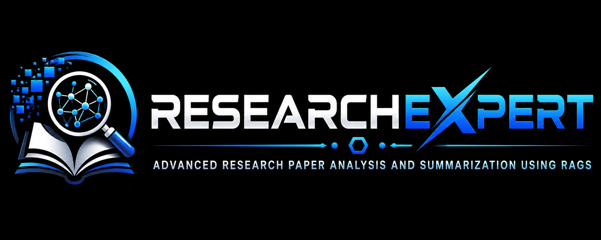

<div align="center">



# ResearchXpert

**Chat with up to 3 research papers at once — section-aware retrieval, zero local GPU needed.**

[](https://www.python.org/)
[](https://streamlit.io/)
[](https://www.langchain.com/)
[](LICENSE)

</div>

---

## 📖 Overview

**ResearchXpert** is a multi-PDF Retrieval-Augmented Generation (RAG) system built to help students and researchers quickly understand and query academic papers. Upload up to three PDFs, ask natural-language questions, and get grounded answers pulled directly from the paper's own sections — Abstract, Methodology, Results, Conclusion, and more — instead of generic summaries.

It was built as a final-year B.Tech capstone project, with a focus on **section-aware retrieval**: rather than treating a paper as one undifferentiated blob of text, ResearchXpert parses the table of contents and section headers so it can answer "What methodology was used?" using the actual Methodology section, not a random chunk from anywhere in the document.

## ✨ Features

- **Multi-PDF support** — load and query up to 3 research papers in a single session
- **Section-aware chunking** — detects TOC entries and standard academic section headers (Abstract, Introduction, Related Work, Methodology, Results, Discussion, Conclusion, etc.) and tags every chunk with its section
- **Smart section routing** — detects when a question is asking about a specific section (e.g. "limitations", "future work") and prioritizes retrieval from that section before falling back to vector similarity search
- **Cloud embeddings** — uses Jina AI's `jina-embeddings-v3` API, so there's no local embedding model and no GPU required
- **Fast inference** — answers generated by Llama 3.3 70B (or other models) via the Groq API for low-latency responses
- **Source transparency** — every answer comes with an expandable view of the retrieved chunks, including source file, page number, and section
- **Clean chat UI** — dark-themed Streamlit interface with chat bubbles, live metrics (PDFs loaded, chunks indexed, Q&A turns), and one-click question suggestions

## 🛠️ Tech Stack

| Layer            | Technology                                          |
|-------------------|------------------------------------------------------|
| UI                | [Streamlit](https://streamlit.io/)                   |
| Orchestration     | [LangChain](https://www.langchain.com/)              |
| Document loading  | `PyPDFLoader`                                        |
| Chunking          | `RecursiveCharacterTextSplitter` + custom section parser |
| Embeddings        | Jina AI `jina-embeddings-v3` (cloud API)             |
| Vector store      | [FAISS](https://github.com/facebookresearch/faiss)   |
| LLM               | Llama 3.3 70B (and other models) via [Groq](https://groq.com/) |

## 📂 Project Structure

```
researchxpert/
├── app.py              # Streamlit UI — sidebar config, chat interface, file upload
├── rag.py              # RAG engine — PDF parsing, section detection, embeddings, retrieval, answering
├── requirements.txt    # Python dependencies
├── logo.png            # App banner/logo
└── README.md
```

## 🚀 Getting Started

### Prerequisites

- Python 3.10+
- A free [Groq API key](https://console.groq.com/) (for the LLM)
- A free [Jina AI API key](https://jina.ai/) (for embeddings — 1M tokens/month free tier)

### Installation

```bash
# Clone the repository
git clone https://github.com/SaiKrishna562/researchxpert.git
cd researchxpert

# (Recommended) Create a virtual environment
python -m venv venv
source venv/bin/activate      # On Windows: venv\Scripts\activate

# Install dependencies
pip install -r requirements.txt
```

### Run the app

```bash
streamlit run app.py
```

The app will open in your browser at `http://localhost:8501`.

### Usage

1. Paste your **Groq API key** and **Jina API key** into the sidebar.
2. Upload up to 3 PDF research papers.
3. Click **⚡ Process PDFs** to embed and index them.
4. Ask questions in the chat box, or click one of the suggested prompts (e.g. *"What methodology was used?"*).
5. Expand **📎 Retrieved chunks** under any answer to see exactly which parts of the paper it was grounded in.

> **Note:** API keys are entered directly in the UI and held only in the Streamlit session — they are never written to disk or committed to this repository.

## 🧠 How It Works

1. **Parsing** — each uploaded PDF is loaded page-by-page via `PyPDFLoader`.
2. **Section detection** — the full text is scanned for a table of contents and for standard academic section headers using regex patterns; the document is split into labeled sections (Abstract, Methodology, Results, etc.).
3. **Chunking** — each section is further split into overlapping chunks (`RecursiveCharacterTextSplitter`), with every chunk tagged with its source file, section name, and approximate page number.
4. **Embedding & indexing** — chunks are embedded via Jina AI and stored in an in-memory FAISS vector index.
5. **Query-time routing** — when a question comes in, ResearchXpert first checks whether it matches a known section name or keyword (e.g. "limitations" → Limitations section) and pulls chunks from that section directly, then supplements with standard vector similarity search.
6. **Answer generation** — the retrieved, labeled context is passed to the LLM (via Groq) with instructions to answer strictly from the provided context and avoid hallucination.

## 🗺️ Roadmap / Ideas

- [ ] Support for more than 3 PDFs per session
- [ ] Persistent vector store (save/reload indexed papers across sessions)
- [ ] Citation-linked answers (jump to the exact page/section in a PDF viewer)
- [ ] Export Q&A session as a PDF/Markdown report
- [ ] Support for local/offline embedding models as a fallback

## 🤝 Contributing

This started as a personal capstone project, but suggestions and pull requests are welcome — feel free to open an issue first to discuss what you'd like to change.

## 📄 License

This project is licensed under the [MIT License](LICENSE).

## 🙋 Author

**Sai Krishna** — B.Tech Final Year, JNTU Hyderabad
